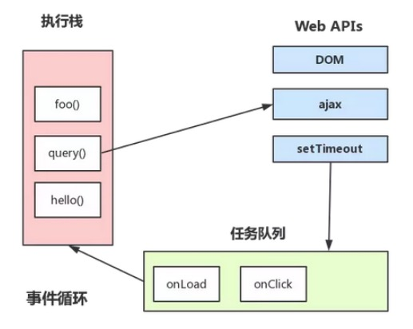

## 语法分析和预编译阶段
```JavaScript
console.log('script start');

setTimeout(function() {
  console.log('setTimeout');
}, 0);

Promise.resolve().then(function() {
  console.log('promise1');
}).then(function() {
  console.log('promise2');
});

console.log('script end');

```
::: tip 概述
js引擎执行过程主要分为三个阶段，分别是语法分析，预编译和执行阶段。
1. 语法分析：分别对加载完成的代码块进行语法检验，语法正确则进入预编译阶段；不正确则停止该代码块的执行，查找下一个代码块并进行加载，加载完成再次进入该代码块的语法分析阶段。
2. 预编译：通过语法分析阶段后，进入预编译阶段，则创建变量对象（创建arguments对象（函数运行环境下）函数声明提前解析，变量声明提升），确定作用域链以及this指向。
:::

### 宏任务（macro-task）
宏任务又按执行顺序分为同步任务和异步任务
- 同步任务
同步任务指的是在JS引擎主线程上按顺序执行的任务，只有前一个任务执行完毕后，才能执行后一个任务，形成一个执行栈（函数调用栈）。
```JavaScript
console.log('script start');
console.log('script end');
```
- 异步任务
异步任务指的是不直接进入JS引擎主线程，而是满足触发条件时，相关的线程将该异步任务推进任务队列（task queue），等待JS引擎主线程上的任务执行完毕，空闲时读取执行的任务，例如异步`Ajax`，`DOM事件`，`setTimeout`等。
```JavaScript
setTimeout(function() {
  console.log('setTimeout');
}, 0);
```
### 微任务（micro-task）
```JavaScript
Promise.resolve().then(function() {
  console.log('promise1');
}).then(function() {
  console.log('promise2');
});
```
在JS引擎执行过程中，进入执行阶段后，代码的执行顺序如下：
> 宏任务（同步任务）-->微任务-->宏任务（异步任务）
所以，上面的输出结果：
```
script start
script end
promise1
promise2
setTimeout
```
进入`ES6`或`Node`环境中，`JS`的任务分为两种，分别是宏任务（macro-task）和微任务（micro-task），在最新的`ECMAScript`中，微任务称为`jobs`，宏任务成为`task`，他们的执行顺序如上。

### 事件循环
理解宏任务中同步任务和异步任务的执行顺序，相当于理解了JS异步执行机制-事件循环
#### 事件循环
事件循环可以理解成由三部分组成，分别是：
1. 主线程执行栈
2. 异步任务等待触发
3. 任务队列

### 任务队列
任务队列就是以队列的数据结构对事件任务进行管理，特点是先进先出，后进后出。

