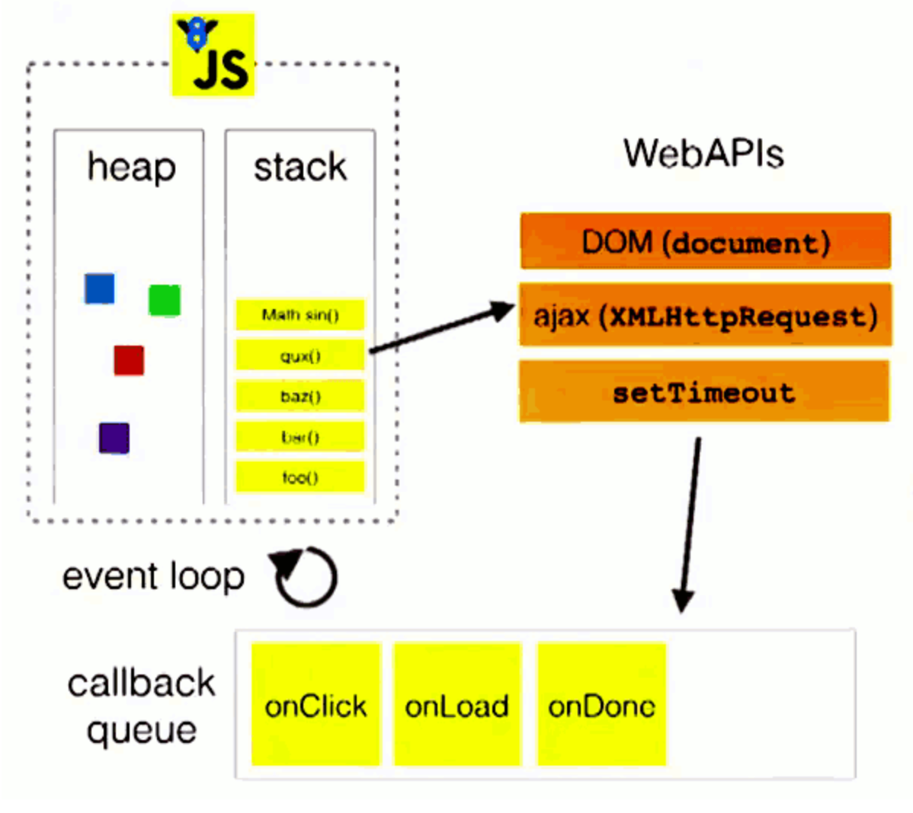

## 为什么会有事件循环
JavaScript从诞生之日起就是一门单线程的非阻塞的脚本语言。
JavaScript两个特点：
- 单线程

JavaScript是单线程的，单线程是指JavaScript引擎中解析和执行JavaScript代码的线程只有一个（主线程），每次只能做一件事情。单线程存在是必然的，在浏览器中，如果JavaScript是多线程的，那么当两个线程同时对dom进行一项操作，例如一个向其添加事件，而另一个删除了这个dom，这个时候其实是矛盾。
- 非阻塞

当JavaScript代码运行一个异步任务的时候（像Ajax等），主线程会挂起这个任务，然后异步任务返回结果的时候再根据特定的结果去执行相应的回调函数。

那么如何做到非阻塞呢？就需要----事件循环（Event Loop）
## 浏览器中的事件循环

当JavaScript代码执行的时候会将变量存于内存中的不同位置：堆（heap）和栈（stack）中来加以区分。其中，堆里存放着一些对象。而栈中则存放着一些基础类型变量以及对象的指针。

**执行栈（call stack）**：当我们调用一个方法的时候，js会生成一个与这个方法对应的执行环境（context），又叫执行上下文。这个执行环境中存在着这个方法的私有作用域，上层作用域的指向，方法的参数，这个作用域中定义的变量以及这个作用域的this对象。而当一系列方法被依次调用的时候，因为js是单线程的，同一时间只能执行一个方法，于是这些方法被排队在一个单独的地方，这个地方被称为执行栈。

比如，这是一段同步代码的执行：
```JavaScript
function a() {
    b();
    console.log('a');
}
function b() {
    console.log('b')
}
a();

```
演示事件循环 [loupe](http://latentflip.com/loupe/?code=ZnVuY3Rpb24gYSgpIHsKICAgIGIoKTsKICAgIGNvbnNvbGUubG9nKCdhJyk7Cn0KZnVuY3Rpb24gYigpIHsKICAgIGNvbnNvbGUubG9nKCdiJykKfQphKCk7!!!PGJ1dHRvbj5DbGljayBtZSE8L2J1dHRvbj4%3D)

执行顺序如下：
- 执行函数a()先入栈
- a()中先执行函数b()，函数b()入栈
- 执行函数b(),console.log('b')入栈
- 输出 b， console.log('b')出栈
- 函数b() 执行完成，出栈
- console.log('a') 入栈，执行，输出 a, 出栈
- 函数a 执行完成，出栈

**事件队列（callback queue）**：js引擎遇到一个异步事件后并不会一直等待其返回结果，而是会将这个事件挂起，继续执行执行栈中的其他任务。当一个异步事件返回结果后，js会将这个事件加入与当前执行栈不同的另一个队列，我们称之为*事件队列*。

被放入事件队列不会立刻执行起回调，而是等待当前执行栈中所有任务都执行完毕，主线程空闲状态，主线程会去查找事件队列中是否有任务，如果有，则取出排在第一位的事件，并把这个事件对应的回调放到执行栈中，然后执行其他的同步代码。
```JavaScript
$.on('button', 'click', function onClick() {
    setTimeout(function timer() {
        console.log('You clicked the button!');    
    }, 2000);
});

console.log("Hi!");

setTimeout(function timeout() {
    console.log("Click the button!");
}, 5000);

console.log("Welcome to loupe.");

```
执行过程如下：
- 首先是，注册了点击事件，异步执行，这个时候会将它放在Web API中
- console.log("Hi!")入栈，直接执行，输出Hi
- 执行setTimeout，异步执行，将其挂载起来
- 执行console.log("Welcome to loupe.")，输出Welcome to loupe.
- 5秒后，setTimeout执行回调，将回调放入到事件队列中，一旦主线程空闲，则取出运行
- 我点击了按钮【这里只操作了一次】，触发了点击事件，将点击事件的回调放入到事件队列中，一旦主线程空闲，则取出运行
- 运行点击事件回调中的setTimeout
- 2秒钟后，setTimeout执行回调，将回调放入到事件队列中，一旦主线程空闲，则取出运行
## 微任务和宏任务
### 微任务--Micro-Task
常见的Micro-Task：new Promise().then(callback)、MutationObserve等（async和await）实际上是Promise的语法糖。
### 宏任务--Macro-Task
常见的Macro-Task：setTimeout、setInterval、script（整体代码）、I/O操作、UI交互事件、postMessage等。
### 事件循环的执行顺序

异步任务的返回结果会被放到一个事件队列中，根据上面提到的异步事件的类型，这个事件实际上会被放到对应的宏任务和微任务中去。

Event Loop的循环过程如下：
- 执行一个宏任务（一般一开始是整体代码（script）），如果没有可选的宏任务，则直接处理微任务
- 执行过程中如果遇到微任务，就将它添加到微任务的任务队列中
- 执行过程中如果遇到宏任务，就将它添加到宏任务的任务队列中
- 执行一个宏任务完成之后，就需要检测微任务队列有没有需要执行的任务，有的话，全部执行，没有的话，进入下一步
- 检查渲染，然后GUI线程接管渲染，进行浏览器渲染
- 渲染完毕后，JS线程继续接管，开始下一个宏任务...（循环上面的步骤）

执行顺序总结：执行宏任务，然后执行该宏任务产生的微任务，若微任务在执行过程中产生了新的微任务，则继续执行微任务，微任务执行完毕后，再回到宏任务中进行下一轮循环

```JavaScript
console.log('start')

setTimeout(function() {
  console.log('setTimeout')
}, 0)

Promise.resolve().then(function() {
  console.log('promise1')
}).then(function() {
  console.log('promise2')
})

console.log('end')

```
分析一下：
- 执行全局script，输出start
- 执行setTimeout，压入macrotask队列，promise.then回调繁缛microtask队列，最后执行console.log('end')，输出end
- 全局script属于宏任务，执行完成那接下来就是执行microtask队列的任务了，执行promise回调打印promise1
- promise回调函数默认返回undefined，promise状态变为fullfill触发接下来的then回调，继续压入microtask队列，event loop会把当前的microtask队列一直执行完，此时执行第二个promise.then，回调打印出promise2
- 这时microtask队列已经为空，接下来主线程会去做一些UI渲染，然后开始下一轮event loop，执行setTimeout回调，打印出setTimeout

故最后结果如下：
```
start
end
promise1
promise2
setTimeout
```